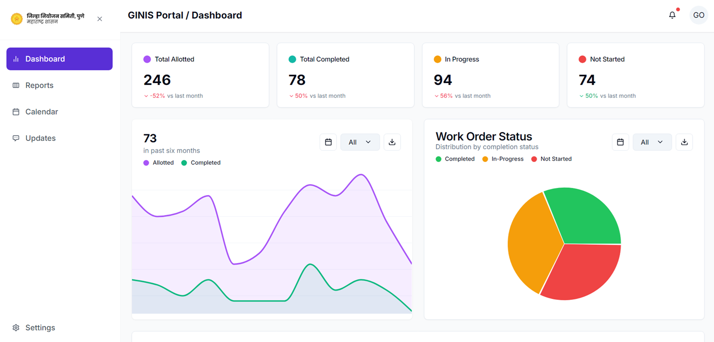

# GINIS Portal - GIS Dashboard

A modern dashboard for managing work orders in the GIS portal. Built with Next.js and ShadCN UI components.

## Dashboard Preview



## Features

- 📊 Interactive work orders dashboard
- 🔍 Filtering, sorting, and searching capabilities
- 📆 Date range filtering
- 📋 Status-based filtering
- 📤 Excel export functionality
- 📱 Responsive design for mobile and desktop

## Technology Stack

- **Frontend**: Next.js 14 with React
- **UI Components**: ShadCN UI
- **Styling**: Tailwind CSS
- **Icons**: Lucide React
- **Date Handling**: date-fns

## Installation

```bash
# Clone the repository
git clone https://github.com/vinaythoke/ginis-portal.git

# Navigate to the project directory
cd ginis-portal

# Install dependencies
npm install

# Run the development server
npm run dev
```

Open [http://localhost:3000](http://localhost:3000) in your browser to see the application.

## Project Structure

```
/
├── components/         # React components
│   ├── dashboard/      # Dashboard-specific components
│   │   ├── charts/     # Chart components
│   │   ├── filters/    # Filter components
│   │   └── tables/     # Table components
│   └── ui/             # UI components (ShadCN)
├── lib/                # Utility functions and types
│   ├── services/       # Data services
│   ├── types.ts        # TypeScript type definitions
│   └── utils/          # Helper utilities
├── public/             # Static assets
└── app/                # Next.js app directory
```

## Development

To start the development server:

```bash
npm run dev
```

## Deployment

The application can be deployed using Vercel:

```bash
npm run build
npm run start
```

## License

[MIT](LICENSE)